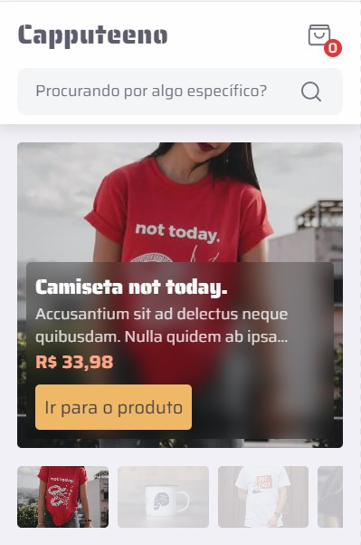
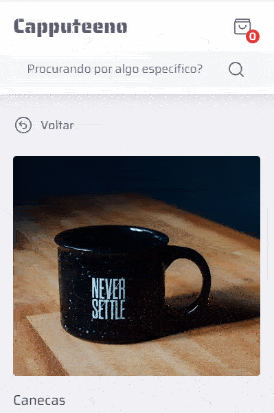
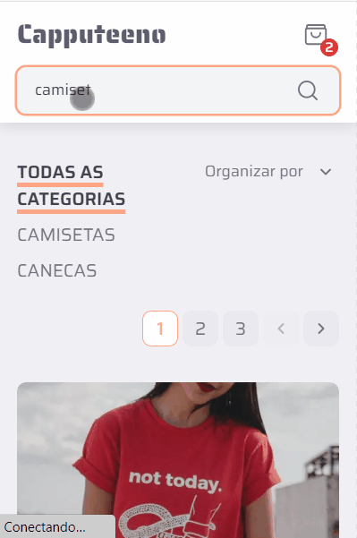
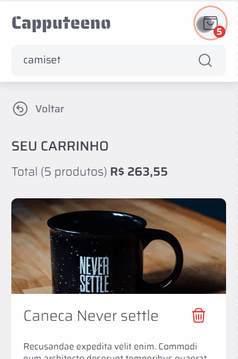
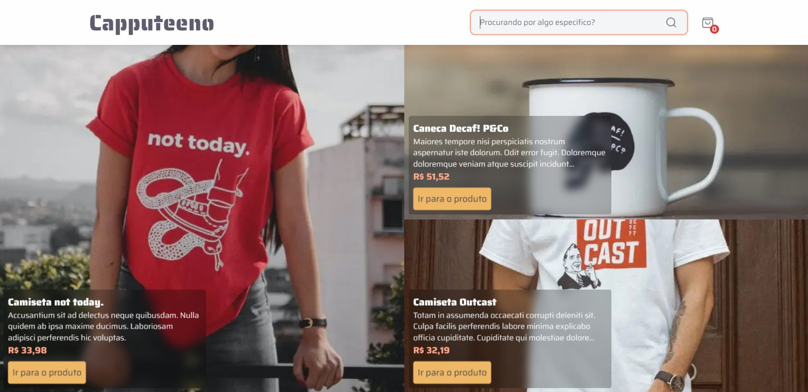
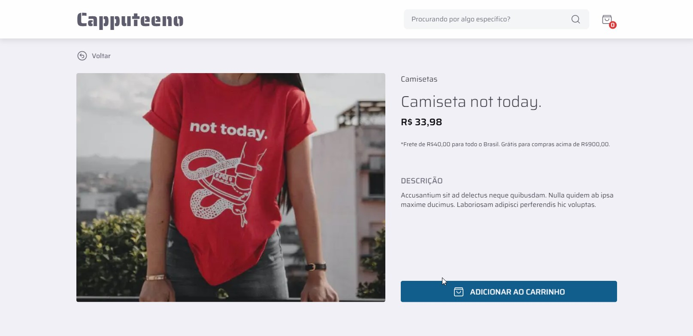
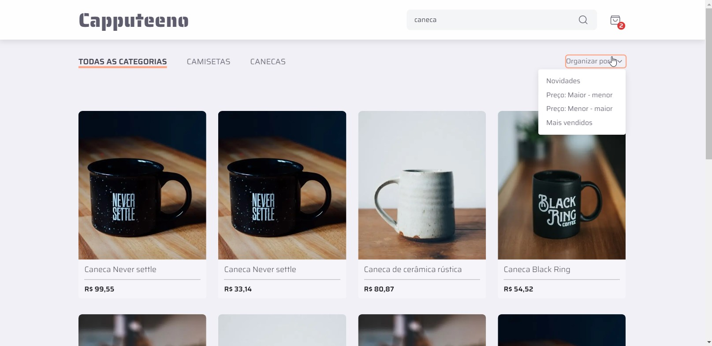
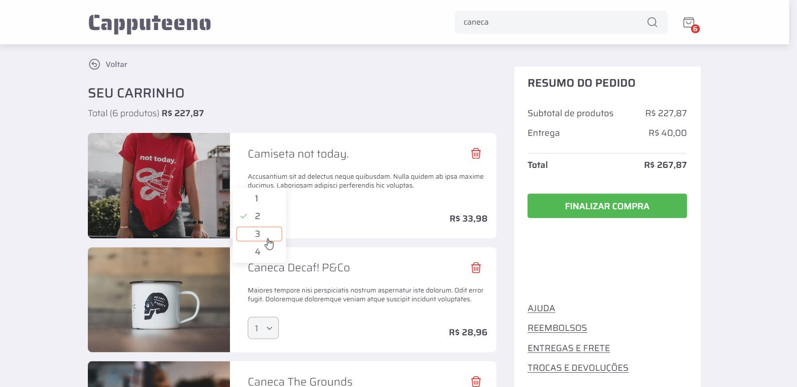

<div align="center">
    
</div>  

<!-- TABLE OF CONTENTS -->

<h5 align="center">
<a href="#sobre">Sobre</a>
   •   <a href="#tecnologias">Tecnologias</a>
   •   <a href="#funcionalidades">Funcionalidades</a>
   •   <a href="#instalação">Instalação</a>
   •   <a href="#visão-do-projeto">Visão do projeto</a>
   •   <a href="#licença">Licença</a>
   •   <a href="#autor">Autor</a>
</h5>

## Sobre

<h4>Capputeeno é um e-commerce para venda de canecas e camisetas.</h4>

Este projeto é baseado no desafio [front-end da Rocketseat](https://github.com/Rocketseat/frontend-challenge) apresentando algumas modificações como a utilização do Tailwind e de cookies.

Para o desenvolvimento do projeto o desafio conta com um [protótipo](https://www.figma.com/file/rET9F2CeUEJdiVN7JRu993/E-commerce---capputeeno?node-id=680%3A6449) no figma.

## Tecnologias

* [TypeScript](https://www.typescriptlang.org/)
* [Next.js](https://nextjs.org/)
* [TailwindCSS](https://tailwindcss.com/)
* [clsx](https://github.com/lukeed/clsx)
* [Radix-ui](https://www.radix-ui.com/)
* [Nookies](https://www.npmjs.com/package/nookies)
* [Embla Carousel React](https://www.embla-carousel.com/get-started/react/)

> Veja o arquivo  [package.json](/capputeeno/package.json)

## Funcionalidades

<details open>
  <summary>Responsividade para as larguras:</summary>

  * [x] 320px
  * [x] 360px
  * [x] 412px
  * [x] 640px
  * [x] 768px
  * [x] 1024px
  * [x] 1280px
  * [x] 1366px
  * [x] 1440px
</details>

* [x] Catálogo de produtos com paginação
* [x] Filtragem de produtos por categoria
* [x] Busca por nome do produto
* [x] Adicionar e remover produtos do carrinho
* [x] Finalizar compra

## Instalação

### **Pré-requisitos**

  * É **necessário** possuir o **[Git](https://git-scm.com/)** instalado e configurado no computador.
  * É **necessário** ter um gerenciador de pacotes seja o **[NPM](https://www.npmjs.com/)** ou **[Yarn](https://yarnpkg.com/)**.

### **Próximo passo**

  1. Faça um clone deste repositório:

     ```bash
     git clone https://github.com/die-goncalves/challenge-capputeeno
     ```

  2. Instale as depêndencias:

      ```bash
      # Entre no diretório do repositório clonado
      $ cd challenge-capputeeno
      ```

      ```bash
      # Entre no diretório do projeto frontend
      $ cd capputeeno
      # Instale as dependências.
      $ yarn #ou $ npm install
      ```
    
      ```bash
      # Volte para o diretório raiz
      $ cd ..
      # Entre no diretório da api
      $ cd api
      # Instale as dependências.
      $ yarn #ou $ npm install
      ```

  3. No diretório capputeeno crie o arquivo **.env.local**.

      ```bash
      # .env.local
      # API
      NEXT_PUBLIC_API_URL=http://localhost:3333
      ```

  4. Execute a aplicação

      ```bash
      # Em um terminal executar a api
      # Partindo do diretório raiz /challenge-capputeeno
      # Entrar na api
      $ cd api
      $ yarn start #ou $ npm run start
      # A api inciará na porta:3333 - acesse <http://localhost:3333>
      ```

      ```bash
      # Em outro executar o frontend
      # Partindo do diretório raiz /challenge-capputeeno
      # ntrar no projeto frontend
      $ cd capputeeno
      $ yarn dev #ou $ npm run dev
      # A aplicação inciará na porta:3000 - acesse <http://localhost:3000>
      ```

## Visão do projeto

📽️ Se os vídeos não funcionarem há imagens de alguns quadros dos vídeos logo abaixo.

***Colocar os videos aqui***

<details closed>
  <summary>🖼️ Imagens</summary>

  | 320px |
  |:----:|
  |    |
  |    |
  |    |
  |    |

  | 1440px |
  |:----:|
  |    |
  |    |
  |    |
  |    |
</details>

## Licença

Esse projeto está sob a licença MIT. Veja o arquivo [LICENSE](LICENSE) para mais detalhes.

## Autor

Feito por Diego Gonçalves, contato:

<a href="https://www.linkedin.com/in/diego-goncalves1990">
    <picture>
      <source media="(prefers-color-scheme: dark)" srcset="https://img.shields.io/badge/Linkedin-Diego_Gonçalves-208BEE?style=flat-square&logo=linkedin&logoColor=208BEE&labelColor=22272E"/>
      <source media="(prefers-color-scheme: light)" srcset="https://img.shields.io/badge/Linkedin-Diego_Gonçalves-208BEE?style=flat-square&logo=linkedin&logoColor=208BEE&labelColor=white"/>
      
    </picture>
</a>

<a href="mailto:die.goncalves1990@gmail.com">
    <picture>
      <source media="(prefers-color-scheme: dark)" srcset="https://img.shields.io/badge/Gmail-die.goncalves1990@gmail.com-EA5134?style=flat-square&logo=gmail&logoColor=EA5134&labelColor=22272E"/>
      <source media="(prefers-color-scheme: light)" srcset="https://img.shields.io/badge/Gmail-die.goncalves1990@gmail.com-EA5134?style=flat-square&logo=gmail&logoColor=EA5134&labelColor=white"/>
      
    </picture>
</a>